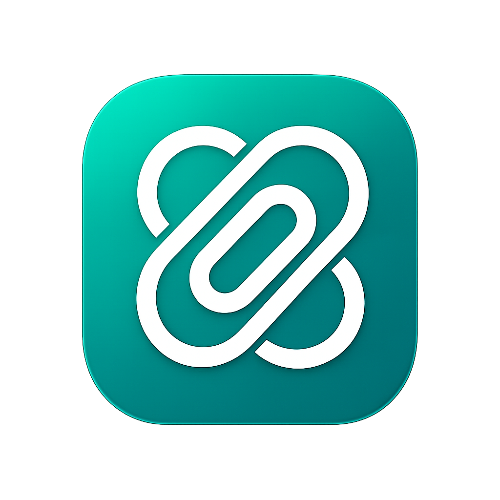

<div align="center">



# Klippy

### *Clip it. Keep it. Copy it.*

A beautiful Chrome extension that serves as your **personal vault** for profile links, passwords, API keys, and secure notes — with one-click copy, smart auto-detection, and master password protection.

[](https://ko-fi.com/G4F124EFM7)
[](https://github.com/pratick29/Klippy)
[](https://github.com/pratick29/Klippy)

</div>

---

## 🎬 Launch Video

https://github.com/user-attachments/assets/klippy-launch-video

> *See Klippy in action — saving links, passwords, API keys, and copying with one click.*

> **Note:** After pushing, upload `klippy-launch-video.mp4` via **GitHub → Releases** or drag it into any issue/PR to get the embeddable link, then replace the URL above.

---

## ✨ Features

| Feature | Description |
|---|---|
| 🔗 **Profile Links** | Store LinkedIn, GitHub, HackerRank, LeetCode, Twitter/X, YouTube, Instagram & custom links |
| 🤖 **Auto-Detection** | Detects the platform when you visit a profile page and offers to save instantly |
| 🔐 **Password Vault** | Store passwords with master-password protection & auto-lock |
| 🗝️ **Key Vault** | Store API keys, SSH keys, and secret tokens securely |
| 📝 **Secure Notes** | Keep code snippets, recovery codes, and scratchpad notes |
| 🎨 **Dark / Light Mode** | Emerald-themed dual-mode UI |
| ⚡ **One-Click Copy** | Copy any credential to clipboard instantly |
| 🔑 **Password Generator** | Generate strong passwords with customizable options |
| 📦 **Import / Export** | Backup and restore your vault as JSON |
| ⌨️ **Keyboard Shortcut** | `Alt+C` to open Klippy from anywhere |

---

## 🚀 Installation (Developer Mode)

1. **Clone** this repository
   ```bash
   git clone https://github.com/pratick29/Klippy.git
   ```
2. Open Chrome and go to **`chrome://extensions`**
3. Enable **Developer Mode** (toggle in top-right corner)
4. Click **Load unpacked** → select the project folder
5. Klippy appears in your extensions toolbar! 🎉

---

## 🛠️ Tech Stack

- **Manifest V3** Chrome Extension
- Vanilla **HTML, CSS, JavaScript** — zero dependencies
- `chrome.storage.local` for persistent encrypted storage
- No external libraries — completely self-contained

---

## ☕ Support

If Klippy saves you time, consider buying me a coffee!

[](https://ko-fi.com/G4F124EFM7)

Every coffee helps keep Klippy free and actively maintained. 💜

---

## 🏢 Made by Pratick Labs

<div align="center">

Built with 💜 by **[Pratick Labs](https://pratikbothra.vercel.app/)**

*Building tools developers love.*

</div>
